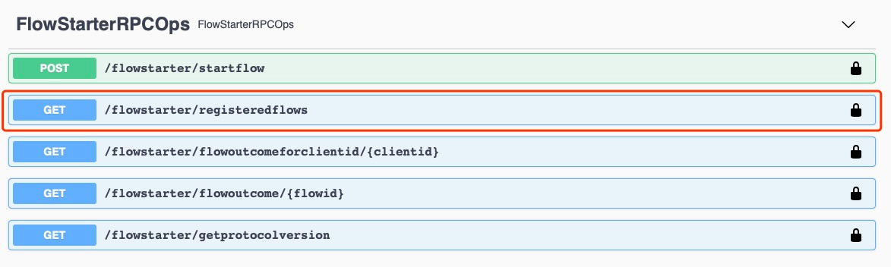

# Corda5 Cordapp Template 

## Environment Requirements: 
1. Download and install Java 11
2. Download and install Docker
3. Download and install `cordapp-builder` (Latest version: 5.0.0-DevPreview)
4. Download and install `corda-cli` (Latest version: 1.0.0-DevPreview)

Step 2 - 4 To find detailed instructions visit the docs site [here](https://docs.r3.com/en/platform/corda/5.0-dev-preview-1.html)

## App Functionalities 
This sample app is a demonstration of how to do a simple Issue and Move transaction in Corda 5, with the help of a 
land registry use case. It has two simple functionality:
 - Issuer can issue land to particular party.
 - The current owner of the land can transfer the land to another party.

## How to run the sample

With Corda 5 test development experience has been re-engineered, it utilizes docker for test deployment. 
We need to follow a couple of steps to test deploy the sample app. 
```
#1 Build the projects.
./gradlew clean build

#2 Create the cpb file from the compiled cpk files in both contracts and workflows.
cordapp-builder create --cpk workflows/build/libs/workflows-1.0.0-DevPreview-cordapp.cpk --cpk contracts/build/libs/contracts-1.0.0-DevPreview-cordapp.cpk -o result.cpb 

#3 Configure the mock network
corda-cli network config docker-compose demo-network

#4 Start docker containers.
corda-cli network deploy -n demo-network -f node-config.yaml | docker-compose -f - up
   
This will download corda/corda-dev image from the docker hub and will take roughly a mintute to complete so wait for the Corda logo to populate. 
    
#5 Install the cpb file into the network.
corda-cli package install -n demo-network result.cpb
```
If all the command are run properly, our sample app should be successfully deployed and running on the test network at this point. 

## Check network status
We can always look at the status of the test network using the command: 
```
corda-cli network status -n demo-network
```

## Interact with the app 
Open a browser and go to `https://localhost:<port>/api/v1/swagger`

For this sample app, the ports are: 
* PartyA's node: 12112
* PartyB's node: 12116
* PartyB's node: 12120

**NOTE: This information is in the status printout of the network. Use the status command that documented above.**

The url will bring you to the swagger API interface, it is a set of HTTP API which you can use out of the box. In order to continue interacting with your app, you would need to log in now. 

Depends on the node that you chose to go to, you would need to log into the node use the correct credentials. 
For this app, the logins are: 
* PartyA - Login: angelenos, password: password
* PartyB - Login: londoner, password: password
* PartyC - Login: mumbaikar, password: password

**NOTE: This information is in the node-config.yaml file.** 

Lets test if you have successfully logged in by go to the RegistedFlows 


You should expect a 200 success callback code, and a response body of such: 
```
[
  "TemplateFlow"
]
```

Now, let's look at the `startflow` API, we will test our tempalteFlow with it. 
in the request body put in: 
```
{
  "rpcStartFlowRequest": {
    "clientId": "launchpad-2", 
    "flowName": "TemplateFlow", 
    "parameters": { 
      "parametersInJson": "{\"msg\": \"Hello-World\", \"receiver\": \"C=GB, L=London, O=PartyB, OU=INC\"}" 
    } 
  } 
}
```
This request carries three pieces of information: 
1. The clientID of this call 
2. The flow we are triggering 
3. The flow parameters that we are providing. 

After the call, you shuold expect a 200 success call code, and a response body as such: 
```
{
  "flowId": {
    "uuid": "81e1415e-be7c-4038-8d06-8e76bdfd8bc7"
  },
  "clientId": "launchpad-2"
}
```
NOTE: This does not mean the transaction is passed through, it means the flow is successfully executed, but the success of the transaction is not guaranteed. 

You would need either go to `flowoutcomeforclientid` or `flowoutcome` to see the result of the flow. In this case, we will use the clientID to query the flow result: 

Enter the clientID of our previous flow call: `launchpad-2`
We will getting the following response: 
```
{
    "status": "COMPLETED",
    "resultJson": "{ \n \"txId\" : \"SHA-256:F0590184B3E026BE79A10857DCC8EBD3482B0D0AE00DA2DC79FA685CF4F0B62F\",\n \"outputStates\" : [\"msg : Hello-World sender : OU=LLC, O=PartyA, L=Los Angeles, C=US receiver : OU=INC, O=PartyB, L=London, C=GB\"], \n \"signatures\": [\"tDTdbtbn/rkUhBLom9lDOikiWspTfQSpsKFC7A5g8N/Bn3kXgA4AYV0BixAgUHy+8chOzXIkxOUo6eVgG/T1Cg==\", \"jEyhgHdfqy5Mo62bFZG6X+4uZ7+6FzkdzzfzczMGxTaER5QROZgEklC2E2jf6SVRsYw+NLHGwfd/K+ESr0sHBw==\"]\n}",
    "exceptionDigest": null
}
```
The completed status of the flow means the success of the flow and its carried transaction. 

Thus far, we had completed a full cycle of running a flow. 

## Shutting down the test network
Finally, we can shut down the test network by using the command:
```
corda-cli network terminate -n demo-network -ry
```
